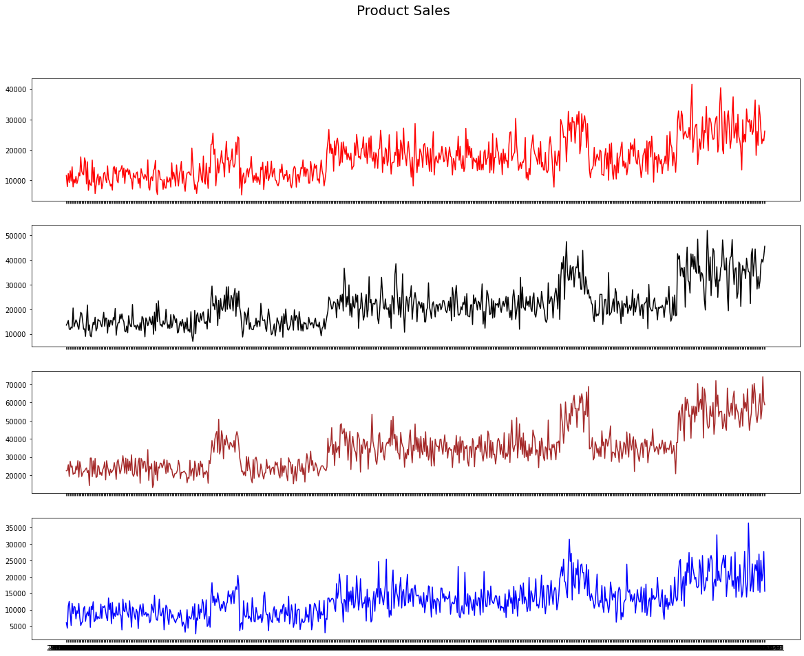
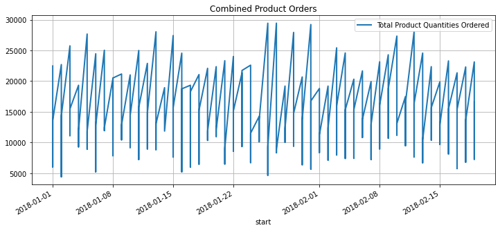
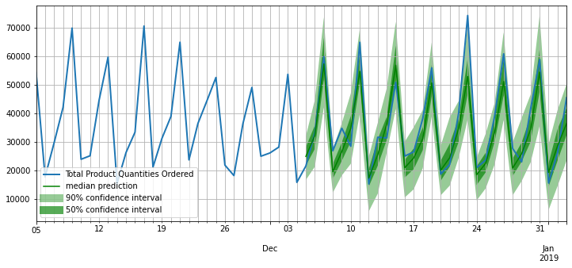
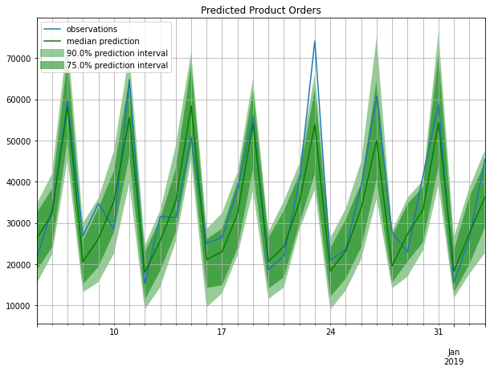

# GLUONTS DEEPAR MODEL
### Created by Elizabeth Khan

<b> Description: </b> Create synthetic data with seasonality for 4 product and use the <b> GLUONTS DEEPAR model </b> to forecast future demand for the synthetic data.


```python
# Import Librarires
import numpy as np
import pandas as pd
import random
import datetime
import os
import json
import matplotlib.pyplot as plt
%matplotlib inline
from matplotlib.pyplot import figure
import sklearn
from gluonts.dataset.common import ListDataset
from gluonts.model import deepar
from gluonts.trainer import Trainer
from gluonts.model.deepar import DeepAREstimator
from itertools import islice
from gluonts.evaluation.backtest import make_evaluation_predictions
from gluonts.evaluation import Evaluator

```

## 1. Create Synthetic Time Series data for 4 product lines

The script below generates <b> 100,000 </b> rows of data for 4 product lines in 2018 to 2019.


```python
## Generate Synthetic Time Series Data for Products

# Define Historical Data Years and Products
years  = [2018,2019]
products = ['product_A', 'product_B', 'product_C', 'product_D']

# Randomly assign products based on probability
product_type = np.random.choice(products, 100000, 
p = [0.4, 0.15, 0.2, 0.25])

#Randomly assign years based on probability
purchaseYear =  np.random.choice(years, 100000, 
p = [0.4,0.6])

# Create DataFrame

yearPurchased = pd.DataFrame({'purchaseYear': purchaseYear, 'product_type':product_type})

```

Create two functions 1) <b> random_date </b> which will assign a random date to each record 2) <b> random_quantity </b> to assign a random demand to each product and add random noise as well as seasonality for November and December


```python
# Assigning Random Dates to Purchases
def random_date (column): 
    for year in range(yearPurchased.shape[0]):
        start_date = datetime.date(column, 1, 1)
        return start_date + datetime.timedelta(days=random.randrange(365)) 
    
#Seasonality in November, December and June
def random_quantity(column):
    quant = [10,15,20,25]
    value = np.random.choice(quant, 1, [.5,.25,.15,.1])
    month = datetime.datetime.strptime(column, "%Y-%m-%d").month
    noise = random.randrange(1000)
    return np.where((month<10)&(month!=6),((value-9)**1.5) + noise ,(value**2) + noise)
```


```python
# Creating a Purchase Data column
yearPurchased['purchase_date'] = yearPurchased.apply(lambda row: random_date(row['purchaseYear']), axis=1)
yearPurchased["purchase_date"]= yearPurchased['purchase_date'].astype('str')

# Creating a quantity ordered by customer column
yearPurchased['quantity_ordered'] = yearPurchased.apply(lambda row: random_quantity(row['purchase_date']), axis=1)
yearPurchased["quantity_ordered"]= yearPurchased['quantity_ordered'].astype('int')
```


```python
#Summarize data by product line
graph = yearPurchased.groupby(by=['purchase_date','product_type'])['quantity_ordered'].sum().reset_index()
```

## 2. Graph all 4 product lines time series data to verify the seasonility and randomness of the data

In the time series graphs there is a consistent seasonality pattern across all four time series and the daily demand appears random. The trend for the product demand also appears to be increasing.


```python
df = {}
products = list(yearPurchased['product_type'].unique())

color = ['red', 'black', 'brown', 'blue']

fig, axs = plt.subplots(4,figsize=(20,15),sharex=True)
fig.suptitle('Product Sales', fontsize=20)
for x in range(len(products)): 
    df[products[x]]= graph[graph['product_type']==products[x]]
    df[products[x]] = df[products[x]].groupby(by='purchase_date')['quantity_ordered'].sum()
    df[products[x]] = pd.Series(df[products[x]])
    axs[x].plot(df[products[x]],color=color[x])
```





## 3. Data Preprocessing 
The DEEPARTS algorithm requires that the data be in a specific format. To prepare the data for the algorithm I will convert the date into the index and only include the target column.


```python
# Prepare dataframe for use in DeepAR algorithm
graph.rename(columns={'purchase_date':'start','product_type':'cat','quantity_ordered':'target'},inplace=True)
graph['start'] = graph.start.astype('object')+' 00:00:00'
graph = graph[['start','target']]

# Create Datetime index for DeepAR algorithm
graph['start'] = pd.to_datetime(graph['start'])
graph.set_index('start', inplace=True)
```

## 4. Graph Combined Product Orders
Next, I want to visualize what the combined product demand looks like before running the algorithm. 


```python
# Graph Existing Data Points
graph['target'][:200].plot(figsize=(12, 5), linewidth=2)
plt.grid()
plt.legend(["Total Product Quantities Ordered"])
plt.title('Combined Product Orders')
plt.show()
```





## 5. Train Model

Since it is a time series model, I am splitting the data in sequential order. I will leave the last 90 days worth of data as the test data set and use the rest of the data for training the model. The data will also be formated into a ``gluonts.dataset.common.ListDataset`` data type. 


```python
# Create Training data set
train_data = ListDataset(
    [
        {"start": graph.index[0],
        "target": graph.target[:pd.to_datetime('2019-06-15 00:00')]
        }
    ],
    freq="d"
)

# Create test data set
test_data = ListDataset(
    [
        {"start": graph.index[0],
        "target": graph.target[pd.to_datetime('2019-10-01 00:00'):]
        }
    ],
    freq="d"
)
```


```python
# Define Hyperparameters in the estimator
# Set hyperparameters to  have forecast horizon of 30 days
estimator = DeepAREstimator(freq="d", 
                            prediction_length=30, 
                            trainer=Trainer(epochs=10))

# Train on training data
predictor = estimator.train(training_data=train_data)
```

    WARNING:root:You have set `num_workers` to a non zero value, however, currently multiprocessing is not supported on windows and therefore`num_workers will be set to 0.
    

    learning rate from ``lr_scheduler`` has been overwritten by ``learning_rate`` in optimizer.
    

    100%|█████████████████████████████████████████████████| 50/50 [00:16<00:00,  3.12it/s, epoch=1/10, avg_epoch_loss=10.5]
    100%|█████████████████████████████████████████████████| 50/50 [00:15<00:00,  3.24it/s, epoch=2/10, avg_epoch_loss=9.83]
    100%|█████████████████████████████████████████████████| 50/50 [00:15<00:00,  3.29it/s, epoch=3/10, avg_epoch_loss=9.75]
    100%|█████████████████████████████████████████████████| 50/50 [00:15<00:00,  3.29it/s, epoch=4/10, avg_epoch_loss=9.72]
    100%|█████████████████████████████████████████████████| 50/50 [00:15<00:00,  3.26it/s, epoch=5/10, avg_epoch_loss=9.72]
    100%|█████████████████████████████████████████████████| 50/50 [00:15<00:00,  3.25it/s, epoch=6/10, avg_epoch_loss=9.69]
    100%|█████████████████████████████████████████████████| 50/50 [00:15<00:00,  3.29it/s, epoch=7/10, avg_epoch_loss=9.67]
    100%|█████████████████████████████████████████████████| 50/50 [00:15<00:00,  3.13it/s, epoch=8/10, avg_epoch_loss=9.68]
    100%|█████████████████████████████████████████████████| 50/50 [00:14<00:00,  3.35it/s, epoch=9/10, avg_epoch_loss=9.67]
    100%|████████████████████████████████████████████████| 50/50 [00:15<00:00,  3.26it/s, epoch=10/10, avg_epoch_loss=9.66]
    

## 3. Make Predictions & Graph Predictions

The <b> make_evaluation_predictions </b> simplifies the prediction process by removing the prediction length from the test data set and predicting 100 sample paths. In the defined function, it will plot the past time series data along with the newly forecasted data. Additionally, the plot will include the confidence intervals at 90% and 50%.


```python
# Plot forecasted values and calculate forecasting metrics
def plot_forecasts(tss, forecasts, past_length, num_plots):
    for target, forecast in islice(zip(tss, forecasts), num_plots):
        ax = target[-past_length:].plot(figsize=(12, 5), linewidth=2)
        forecast.plot(color='g')
        plt.grid(which='both')
        plt.legend(["Total Product Quantities Ordered", "median prediction", "90% confidence interval", "50% confidence interval"])
        plt.show()


forecast_it, ts_it = make_evaluation_predictions(test_data, predictor=predictor, num_samples=100)

forecasts = list(forecast_it)
tss = list(ts_it)
plot_forecasts(tss, forecasts, past_length=60, num_plots=3)

evaluator = Evaluator(quantiles=[0.1, 0.5, 0.9])

agg_metrics, item_metrics = evaluator(iter(tss), iter(forecasts), num_series=len(test_data))
```

    WARNING:root:You have set `num_workers` to a non zero value, however, currently multiprocessing is not supported on windows and therefore`num_workers will be set to 0.
    





    Running evaluation: 100%|████████████████████████████████████████████████████████████████| 1/1 [00:00<00:00, 38.47it/s]
    

This plot below shows the predicted values (last 30 days) within the 75% and 90% Confidence intervals. The blue line is the actual time series data whereas the greeen line is the median predicted value. Overall, the predictions look relatively close with the exception of the 24th day where the prediction is well over 70,000 and the median predicted value is around 55,000.


```python
plot_length = 30
prediction_intervals = (75.0, 90.0)
legend = ["observations", "median prediction"] + [f"{k}% prediction interval" for k in prediction_intervals][::-1]

fig, ax = plt.subplots(1, 1, figsize=(10, 7))
tss[0][-plot_length:].plot(ax=ax)  # plot the time series
forecasts[0].plot(prediction_intervals=prediction_intervals, color='g')
plt.grid(which="both")
plt.title('Predicted Product Orders')
plt.legend(legend, loc="upper left")
plt.show()
```





## 4. Evaluate the model

<b> Mean Absolute Percentage Error (MAPE)</b> and <b> Mean Standard Error (MSE) </b> are popular metrics used to evaluate a forecast. The MAPE is moderately low which indicates the model is performing at a reasonable level. However, this data is synthetic and the above KPIs should be compared to industry benchmarks to assess the overall performance of the model. Likewise, the MSE and absolute are of 160,000+ indicate that the model could use improvement which could likely be achieved by additional hyperparameter tuning.


```python
#Display Metrics
item_metrics.head()
```


<div>
<style scoped>
    .dataframe tbody tr th:only-of-type {
        vertical-align: middle;
    }

    .dataframe tbody tr th {
        vertical-align: top;
    }

    .dataframe thead th {
        text-align: right;
    }
</style>
<table border="1" class="dataframe">
  <thead>
    <tr style="text-align: right;">
      <th></th>
      <th>item_id</th>
      <th>MSE</th>
      <th>abs_error</th>
      <th>abs_target_sum</th>
      <th>abs_target_mean</th>
      <th>seasonal_error</th>
      <th>MASE</th>
      <th>MAPE</th>
      <th>sMAPE</th>
      <th>OWA</th>
      <th>MSIS</th>
      <th>QuantileLoss[0.1]</th>
      <th>Coverage[0.1]</th>
      <th>QuantileLoss[0.5]</th>
      <th>Coverage[0.5]</th>
      <th>QuantileLoss[0.9]</th>
      <th>Coverage[0.9]</th>
    </tr>
  </thead>
  <tbody>
    <tr>
      <th>0</th>
      <td>NaN</td>
      <td>4.459839e+07</td>
      <td>160037.28125</td>
      <td>1081702.0</td>
      <td>36056.733333</td>
      <td>18110.192878</td>
      <td>0.294562</td>
      <td>0.149585</td>
      <td>0.156095</td>
      <td>NaN</td>
      <td>1.978184</td>
      <td>68019.941992</td>
      <td>0.0</td>
      <td>160037.28125</td>
      <td>0.333333</td>
      <td>61535.008984</td>
      <td>0.833333</td>
    </tr>
  </tbody>
</table>
</div>


